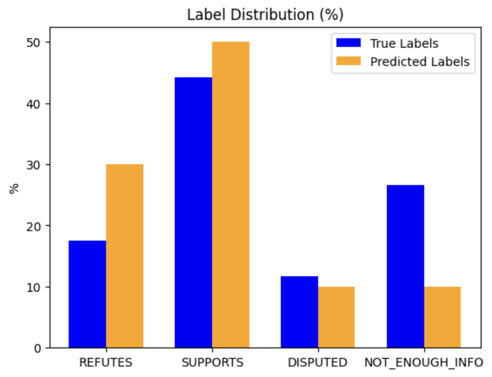

# BERT Fact Checker for Climate

This repository aims to create a machine fact checker for climate-related claims using BERT for embedding creation and fine-tuning. The fact checker classifies claims into four categories: `REFUTES`, `SUPPORTS`, `DISPUTED`, and `NOT_ENOUGH_INFO`, based on evidence stored in `evidence.json` (this file is not included in the repository due to its large size).

## Model Architecture

The core of this fact checker is a fine-tuned BERT model (`bert-base-uncased`). The process includes:

1. **Concatenation of Claims and Evidence**: Claims are concatenated with corresponding evidence into a single input for BERT.
2. **Encoding**: The concatenated text is tokenized and encoded using the BERT tokenizer, with padding and truncation applied to ensure a fixed length of 128 tokens.
3. **Classification**: The encoded text is passed through a classifier built on top of BERT, which outputs one of the four possible claim labels.
4. **Loss and Optimization**: The model is trained using cross-entropy loss and optimized using Adam with a learning rate of 2e-5.

## Training and Evaluation

The training loop runs for 10 epochs, and the model's performance is evaluated on the development set (used as a test set in this case, since the original test set is unlabeled). During evaluation, the accuracy and F1 score are computed based on the predicted vs. true labels.

- **validation set accuracy**: 0.49
- **validation set F1 Score**: 0.46

The plot below visualizes the distribution of true vs. predicted labels:

## Usage

For convenience, this project is recommended to be run on [Colab](https://colab.research.google.com/) with GPU acceleration.

## Background

This project is a modification of Project 3 from [Natural Language Processing](https://handbook.unimelb.edu.au/2024/subjects/comp90042) (COMP90042) at the University of Melbourne, Semester 1, 2024.
